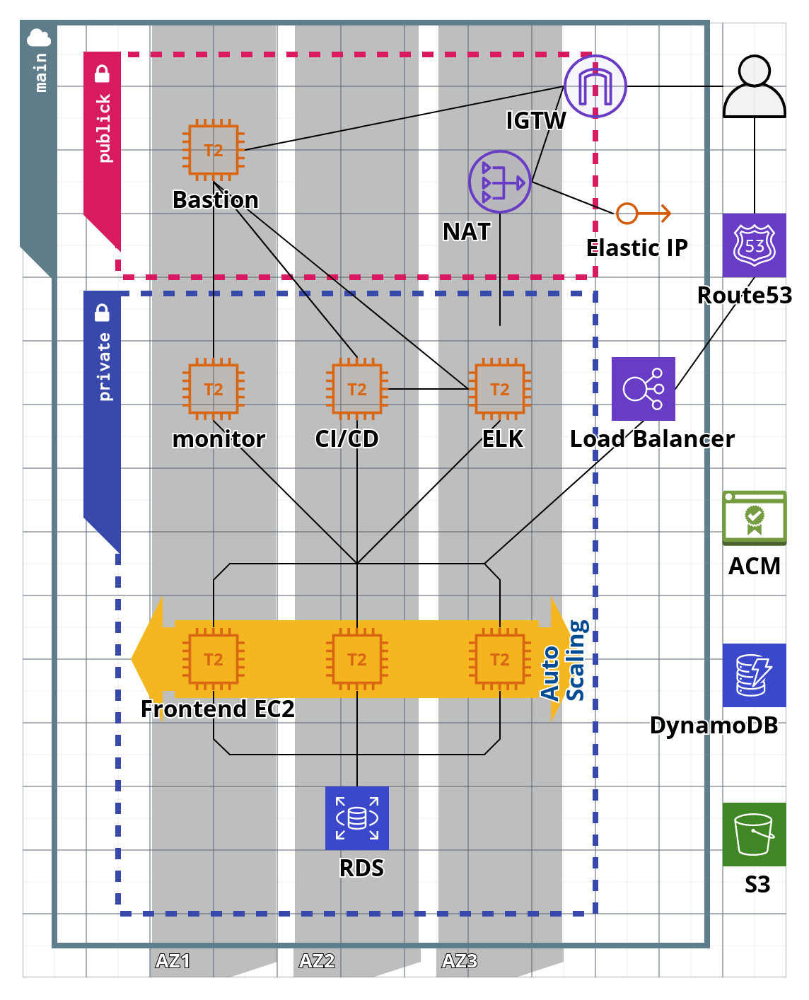

## Infrastructure steps
##### 1 Set your credential in TerraformCloud
```
AWS_ACCESS_KEY_ID=D****************K
AWS_SECRET_ACCESS_KEY=b******************************f
AWS_DEFAULT_REGION=af-south-1
```

##### 2 Set your variable in TerraformCloud
```
rds usrname pass 
ssh keys for bastion and private subnet
runner tocken
token registry
user_registry
your ip
public Hosted Zone Name
subdomain name
```
_________________________________
### Manual start building infrastructure

_________________________________
### Structure image



_________________________________
### Folder structure

```
.
├── module
│   ├── bastion
│   │   ├── example
│   │   │   └── user_data.sh
│   │   ├── main.tf
│   │   ├── output.tf
│   │   └── variable.tf
│   ├── bs3
│   │   ├── main.tf
│   │   └── variable.tf
│   ├── ci-cd
│   │   ├── example
│   │   │   └── user_data.sh
│   │   ├── main.tf
│   │   ├── output.tf
│   │   └── variable.tf
│   ├── deploy
│   │   ├── example
│   │   │   └── user_data.sh
│   │   ├── main.tf
│   │   ├── output.tf
│   │   └── variable.tf
│   ├── elk
│   │   ├── example
│   │   │   └── user_data.sh
│   │   ├── main.tf
│   │   ├── output.tf
│   │   └── variable.tf
│   ├── monitor
│   │   ├── example
│   │   │   └── user_data.sh
│   │   ├── main.tf
│   │   ├── output.tf
│   │   └── variable.tf
│   ├── network
│   │   ├── main.tf
│   │   ├── output.tf
│   │   └── variable.tf
│   └── rds
│       ├── main.tf
│       ├── output.tf
│       └── variable.tf
├── README.md
├── output.tf
├── main.tf
└── variable.tf

15 directories, 35 files
```
